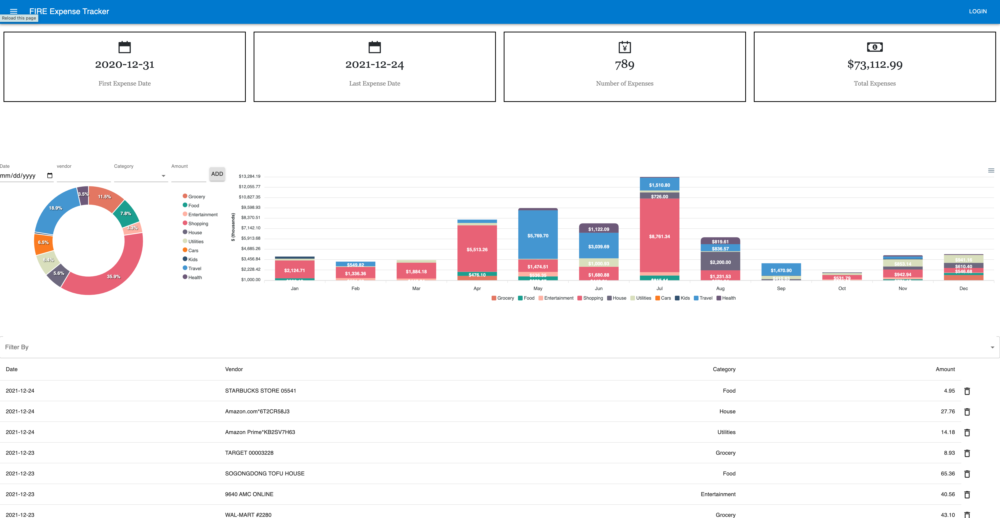

# MVP FIRE EXPENSE TRACKER
This is a full stack react application for users to sign in and track their monthly expenses. The application is supported by REST API and Mongo DB.


## Installation

1) Fork project and clone to local repository

2) Install all packages by running the following commands in your terminal.

```
npm install
```

3) create .env file and create variable

```
PORT=3000
```


4) Start the server(runs Nodemon on server>index.js). In the terminal type
```
npm run dev-server
```
5) Start webpack (webpack serve --open). Install nodemon, In the terminal type

```
npm run watch
```

6) Open the website in your web browser.

```
http://localhost:3000

```


## Application Overview

The website is divided into three serctions:
  1. The summary windows gives you information on: 
 
    1. The first expense occurred
    2. The last expense occurred
    3. How many expense transactions in total
    4. The total expenses accumulated

  2. The chart analysis displays the ratio on each expense category and indicates the expense trends over a year spreadig over different months

  3. Transaction details window allows users to sort transctions by clicking the column title and filter transactions by selecting from the drop down menu


  ## Future Enhancements

  * Plan to do regression analysis to predict next month's expenses
  * Plan to add feature to enable recording entry using voice
  * Plan to add clickable featuer in the chart to show details

